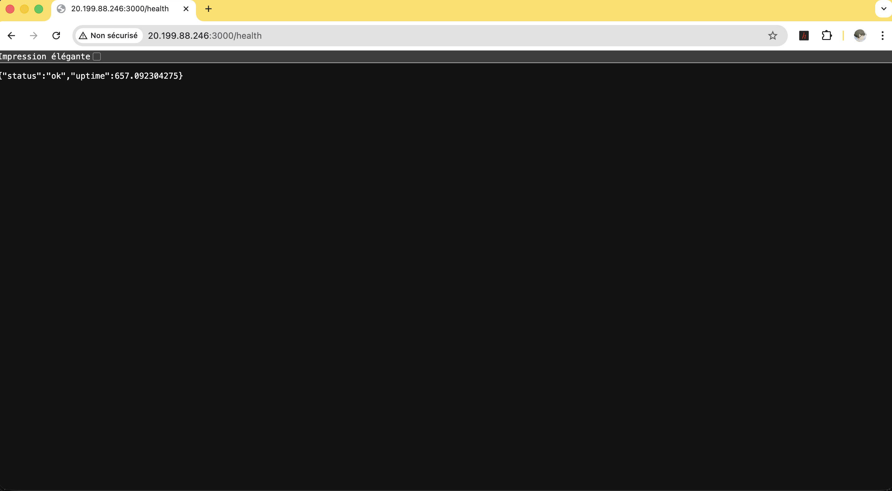

# TP Antoine Rocq

App simple avec CI/CD et déploiement automatique sur VM Azure



(http://20.199.88.246:3000/health)

---

## Fonctionnement du pipeline

```
git push (main)
       ↓
GitHub Actions
       ↓
  Job 1 — Tests unitaires (Jest + Supertest)
       ↓
  Job 2 — Tests E2E (Jest + HTTP natif)
       ↓  (uniquement si Job 1 & 2 OK)
  Job 3 — Build image Docker + Push Docker Hub
       ↓
  Job 4 — Déploiement SSH sur VM Azure + Healthcheck
```

## Comment le déploiement est déclenché

Tout push sur la branche `main` déclenche automatiquement la pipeline. Aucune action manuelle n'est requise.

Les jobs 3 et 4 ne s'exécutent que si les tests unitaires **et** E2E passent (`needs: [unit-tests, e2e-tests]`).

---

## Endpoints de l'API

| Méthode | Route             | Description                       |
|---------|-------------------|-----------------------------------|
| GET     | `/health`         | Healthcheck (affichage du status et uptime) |
| GET     | `/api/items`      | Affiche d'une liste statique d'items |
| POST    | `/api/items`      | Créer un item (`{ "name": "X" }` et id Date unique) |
| GET     | `/api/hello/:name`| Message de salutation personnalisé avec paramètre dans la barre de recherche |

---

## Lancer en local

```bash
npm install
npm start
# → http://localhost:3000/health
```

## Lancer avec Docker

```bash
docker build -t myapp .
docker run -d --name myapp -p 3000:3000 myapp
# → http://localhost:3000/health
```

## Lancer les tests

```bash
# Tests unitaires
npm test

# Tests E2E (nécessite le serveur démarré)
npm start &
npm run test:e2e
```

---

## Secrets GitHub à configurer

| Secret | Valeur |
|---|---|
| `DOCKERHUB_USERNAME` | username Dockerhub |
| `DOCKERHUB_TOKEN` | Token d'accès Docker Hub |
| `AZURE_VM_HOST` | IP publique de la VM Azure |
| `AZURE_VM_USER` | Utilisateur SSH |
| `AZURE_SSH_PRIVATE_KEY` | Clé privée SSH |

---

## Architecture

```
myapp/
├── src/
│   ├── app.js          # app 
│   └── server.js       # Démarrage du serveur
├── tests/
│   ├── unit/
│   │   └── app.test.js     # Tests unitaires
│   └── e2e/
│       └── app.e2e.test.js # Tests end-to-end
├── .github/
│   └── workflows/
│       └── ci-cd.yml   # Pipeline GitHub Actions
├── Dockerfile
├── .dockerignore
└── package.json
```
